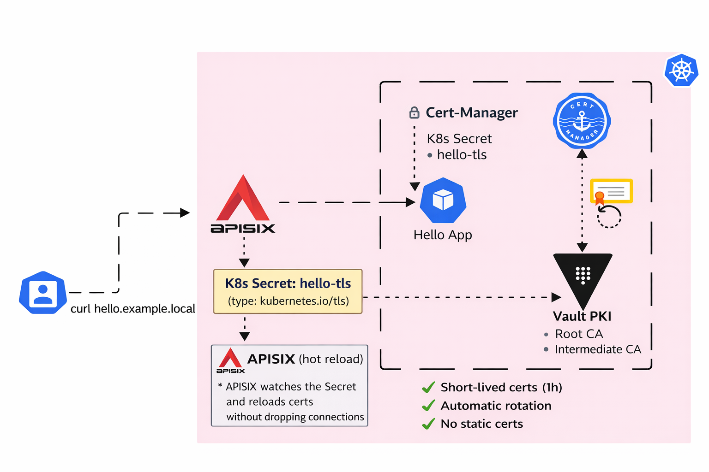

# Certificate Rotation in Zero Trust Internal Environments

In this guide you will learn how to configure an automated zero-downtime certificate rotation. We will integrate Vault as the Root/Intermediate CA, Cert Manager for lifecycle orchestration, and Apache APISIX as the secure Gateway.

## General Diagram

The following diagram illustrates the flow: Cert-Manager requests certificates from Vault via the Kubernetes Auth Method. Once signed, the certificates are stored as Kubernetes Secrets and automatically consumed by APISIX to secure internal traffic.



**NOTE:** `Vault-cluster-keys.json` file is exposed here for practical purposes only. You should never share this information in repositories; instead, store and manage it securely.

## Tools Installation

### Apisix Installation

We use APISIX as our Cloud-Native API Gateway to handle TLS termination and traffic routing.

```bash
helm repo add apisix https://apache.github.io/apisix-helm-chart
helm repo update
helm upgrade -i apisix apisix/apisix \
  --namespace ingress-apisix \
  --create-namespace \
  -f values-apisix.yaml
```

Validate pod status.

```bash
kubectl -n ingress-apisix get pods
# NAME                                         READY   STATUS    RESTARTS   AGE
# apisix-6b98465656-nx8k7                      1/1     Running   0          2m13s
# apisix-etcd-0                                1/1     Running   0          2m13s
# apisix-etcd-1                                1/1     Running   0          2m13s
# apisix-etcd-2                                1/1     Running   0          2m13s
# apisix-ingress-controller-669b5df666-kl648   2/2     Running   0          2m13s
```

### Cert Manager Installation

Cert-Manager acts as the controller that monitors Certificate resources and ensures they are renewed before expiration.

```bash
helm repo add jetstack https://charts.jetstack.io
helm repo update

export CERT_MANAGER_LATEST=$(helm search repo jetstack/cert-manager --versions | awk '{print $2}' | sort -rV | head -n 1)

helm install cert-manager jetstack/cert-manager \
  --namespace cert-manager \
  --create-namespace \
  --version $CERT_MANAGER_LATEST \
  --set crds.enabled=true
```

Validate pod status.

```bash
kubectl -n cert-manager get pods
# NAME                                       READY   STATUS    RESTARTS   AGE
# cert-manager-69fd4bc5fc-fvmwf              1/1     Running   0          63s
# cert-manager-cainjector-85b6d7fc67-fqf8t   1/1     Running   0          63s
# cert-manager-webhook-cfbc49fc8-578t4       1/1     Running   0          63s
```

### Vault Installation

Vault serves as the high-entropy secrets engine. In this guide, we use a standalone instance for lab purposes.

```bash
helm repo add hashicorp https://helm.releases.hashicorp.com
helm repo update
helm install vault hashicorp/vault \
  --namespace vault \
  --create-namespace \
  --set server.dev.enabled=false \
  --set server.ha.enabled=false \
  --set server.standalone.enabled=true \
  --set server.dataStorage.enabled=true \
  --set server.dataStorage.size=1Gi
```

**NOTE:** It's recommendable to give more storage size and enable [HA](https://developer.hashicorp.com/vault/tutorials/kubernetes/kubernetes-raft-deployment-guide#using-helm-charts) in production environments.

## Certificate Rotation

To adhere to Zero Trust principles, we establish a hierarchy: a Root CA (long-lived, offline) and an Intermediate CA (shorter-lived, online) that actually signs the certificates.

### Initializing and Unsealing

Vault starts in a "Sealed" state. You must provide the threshold of keys to access the decryption master key.

```bash
kubectl -n vault exec vault-0 -- vault operator init -key-shares=5 -key-threshold=3 -format=json > vault-cluster-keys.json
cat vault-cluster-keys.json 
# {
#   "unseal_keys_b64": [
#     "xXsT7ATrwa/p8xu25Qh5w1i45Ws52/HaTNTgV/IgGrVu",
#     "tawyjr3+ephYGp2UVG1R2rHx/llhdFvwOAJTuUSVEir6",
#     "qYtPJw258fVsuGT3+c2FW/UBLDAFdDbkKNrOfy7LBWZ4",
#     "94bUWqcInGiAHkp8XMPNj5aySDIvh+6KjTGwP2xV1Srh",
#     "/35mrdLuVknLM7Y3aIyBSJ6lxMI49+3Yr1ZHS22pvmtv"
#   ],
#   "unseal_keys_hex": [
#     "c57b13ec04ebc1afe9f31bb6e50879c358b8e56b39dbf1da4cd4e057f2201ab56e",
#     "b5ac328ebdfe7a98581a9d94546d51dab1f1fe5961745bf0380253b94495122afa",
#     "a98b4f270db9f1f56cb864f7f9cd855bf5012c30057436e428dace7f2ecb056678",
#     "f786d45aa7089c68801e4a7c5cc3cd8f96b248322f87ee8a8d31b03f6c55d52ae1",
#     "ff7e66add2ee5649cb33b637688c81489ea5c4c238f7edd8af56474b6da9be6b6f"
#   ],
#   "unseal_shares": 5,
#   "unseal_threshold": 3,
#   "recovery_keys_b64": [],
#   "recovery_keys_hex": [],
#   "recovery_keys_shares": 0,
#   "recovery_keys_threshold": 0,
#   "root_token": "hvs.TRt84KuhsSPBD0Fo9jCJuUak"
# }
```

**NOTE:** Notice that, we created 5 unseal keys by `-key-shares`, meanwhile the value of `-key-threshold` specifies how many valid keys are required to unseal Vault.

Validate pod status.

```bash
kubectl -n vault get pods
# NAME                                    READY   STATUS    RESTARTS   AGE
# vault-0                                 0/1     Running   0          9m
# vault-agent-injector-784678cdd6-vmghq   1/1     Running   0          9m
```

This is the expected behaviour, Vault always start in sealed status and it is needed unseal it using the keys generated above.

So, let's unseal Vault.

```bash
kubectl -n vault exec -it vault-0 -- vault operator unseal 
# Unseal Key (will be hidden): 
# Key                Value
# ---                -----
# Seal Type          shamir
# Initialized        true
# Sealed             true
# Total Shares       5
# Threshold          3
# Unseal Progress    1/3
# Unseal Nonce       1698abbd-bb33-53d6-8397-47f487b69760
# Version            1.20.4
# Build Date         2025-09-23T13:22:38Z
# Storage Type       file
# HA Enabled         false
kubectl -n vault exec -it vault-0 -- vault operator unseal
# Unseal Key (will be hidden): 
# Key                Value
# ---                -----
# Seal Type          shamir
# Initialized        true
# Sealed             true
# Total Shares       5
# Threshold          3
# Unseal Progress    2/3
# Unseal Nonce       1698abbd-bb33-53d6-8397-47f487b69760
# Version            1.20.4
# Build Date         2025-09-23T13:22:38Z
# Storage Type       file
# HA Enabled         false
kubectl -n vault exec -it vault-0 -- vault operator unseal
# Unseal Key (will be hidden): 
# Key             Value
# ---             -----
# Seal Type       shamir
# Initialized     true
# Sealed          false
# Total Shares    5
# Threshold       3
# Version         1.20.4
# Build Date      2025-09-23T13:22:38Z
# Storage Type    file
# Cluster Name    vault-cluster-9650fd05
# Cluster ID      630eb71c-ed67-249a-2735-9784929787fc
# HA Enabled      false
# / $ 
```

Notice that, we typed 3 keys to unseal Vault and make it accesible. Validate the pod status again.

```bash
kubectl -n vault get pods
# NAME                                    READY   STATUS    RESTARTS   AGE
# vault-0                                 1/1     Running   0          10m
# vault-agent-injector-784678cdd6-vmghq   1/1     Running   0          10m
```

Now, Vault is accessible.

**NOTE:** For production is common to find Auto-Unseal solutions to avoid human intervention. Nowadays, the most used are [Cloud KMS](https://developer.hashicorp.com/vault/docs/secrets) or [Transit](https://developer.hashicorp.com/vault/docs/secrets/transit). You can also implement autounseal managed by yourself as I did in this [guide](https://github.com/juancamilocc/virtual_resources/wiki/autounseal-vault).

### Vault Configuration

Authenticate as root to get full permissions.

```bash
kubectl -n vault exec -it vault-0 -- vault login 
# Token (will be hidden): 
# Success! You are now authenticated. The token information displayed below
# is already stored in the token helper. You do NOT need to run "vault login"
# again. Future Vault requests will automatically use this token.

# Key                  Value
# ---                  -----
# token                hvs.LmvxsRf3rU4cT30Zfb0BbFYr
# token_accessor       NbSIIe1YXtgHKF4cQOJZzO3w
# token_duration       ∞
# token_renewable      false
# token_policies       ["root"]
# identity_policies    []
# policies             ["root"]
```

We enable the PKI engine and define the internal URLs for Certificate Revocation Lists (CRL) and Authority Information Access (AIA).

```bash
kubectl -n vault exec vault-0 -- vault secrets enable pki
# Success! Enabled the pki secrets engine at: pki/

kubectl -n vault exec vault-0 -- vault secrets tune -max-lease-ttl=87600h pki
# Success! Tuned the secrets engine at: pki/

kubectl -n vault exec vault-0 -- vault write pki/config/urls \
    issuing_certificates="http://vault.vault.svc.cluster.local:8200/v1/pki/ca" \
    crl_distribution_points="http://vault.vault.svc.cluster.local:8200/v1/pki/crl"
# Key                              Value
# ---                              -----
# crl_distribution_points          [http://vault.vault.svc.cluster.local:8200/v1/pki/crl]
# delta_crl_distribution_points    []
# enable_templating                false
# issuing_certificates             [http://vault.vault.svc.cluster.local:8200/v1/pki/ca]
# ocsp_servers                     []
```

Generate the CA Root, defining ttl.

```bash
kubectl -n vault exec vault-0 -- vault write pki/root/generate/internal \
    common_name="Root CA Lab" \
    ttl=87600h
# Key              Value
# ---              -----
# certificate      -----BEGIN CERTIFICATE-----
# MIIDtzCCAp+gAwIBAgIUSucqQEhlM1VmtZMycBzGkANWtp8wDQYJKoZIhvcNAQEL
# BQAwFjEUMBIGA1UEAxMLUm9vdCBDQSBMYWIwHhcNMjYwMTE4MTUyODIxWhcNMzYw
# MTE2MTUyODUxWjAWMRQwEgYDVQQDEwtSb290IENBIExhYjCCASIwDQYJKoZIhvcN
# AQEBBQADggEPADCCAQoCggEBAOJLgqTt6F4mMEHRe+6EnDK4ckX0a7iLR+pmTM4y
# GlslxnxzfR58Ltql8HQU2JCIDrK1pBBTbMA7EyGjIJfmPm733d4jE3jcBs/8ezBX
# yCKJMjh6A/Q6jLyDtt7PP7WkLWfzDbs6ViJ2QWMsv0RjVBW5qJaLj8wpJXRSuOdO
# SFzBBdaHD3FVTypkFHYg9j8UDfs3wYBO0dJQE9eTqGSisgtgcTfdBoJJgdgQFuFj
# Em5tyjWnNtMvcWaTxUEayqNhvO9afHnT7jc/661C7QGIVciUMdqAkNGDX5sUtvfJ
# DEb4KYAsq0B/knaUiIhwmhseOyHxPVHIigZvGwQY0WfNlpcCAwEAAaOB/DCB+TAO
# BgNVHQ8BAf8EBAMCAQYwDwYDVR0TAQH/BAUwAwEB/zAdBgNVHQ4EFgQU0SPEH2vq
# HazBUFLQXfQvCOPoeLMwHwYDVR0jBBgwFoAU0SPEH2vqHazBUFLQXfQvCOPoeLMw
# TwYIKwYBBQUHAQEEQzBBMD8GCCsGAQUFBzAChjNodHRwOi8vdmF1bHQudmF1bHQu
# c3ZjLmNsdXN0ZXIubG9jYWw6ODIwMC92MS9wa2kvY2EwRQYDVR0fBD4wPDA6oDig
# NoY0aHR0cDovL3ZhdWx0LnZhdWx0LnN2Yy5jbHVzdGVyLmxvY2FsOjgyMDAvdjEv
# cGtpL2NybDANBgkqhkiG9w0BAQsFAAOCAQEAUXaAdxqfAavALoV0BX3a+MrXYlr9
# 9reyDlgOq5DZJViniGfVOE/gFAYBtp1UYeaNzP3fYON4eEhqneSt/bbXSShb/bNR
# t3n/PGv8MaZ6aR/r+BZi24fayTrxzx/acGbYCiCC20OCnTmOUG/AiSvzno94e1QP
# Vvmj5gliCCk4cuG52Yi6bY5vsb87tk22K/T1L8UuYDsKu8VXtrA9PIr1p2qkIeob
# k4+TS5W0PszMa9lrgseaAGErjBRVOEVN9zgQ0O2ik847NLcHMg/ul0kRURT0kXpL
# 1U12b7iAM2j7k3tFX9HsMaw6vcDPDcuXVclhdGcCV4vOtWnLQT4XrSCWRA==
# -----END CERTIFICATE-----
# expiration       2084110131
# issuer_id        0e156118-d3c7-2bc6-4878-9d74c459ab0c
# issuer_name      n/a
# issuing_ca       -----BEGIN CERTIFICATE-----
# MIIDtzCCAp+gAwIBAgIUSucqQEhlM1VmtZMycBzGkANWtp8wDQYJKoZIhvcNAQEL
# BQAwFjEUMBIGA1UEAxMLUm9vdCBDQSBMYWIwHhcNMjYwMTE4MTUyODIxWhcNMzYw
# MTE2MTUyODUxWjAWMRQwEgYDVQQDEwtSb290IENBIExhYjCCASIwDQYJKoZIhvcN
# AQEBBQADggEPADCCAQoCggEBAOJLgqTt6F4mMEHRe+6EnDK4ckX0a7iLR+pmTM4y
# GlslxnxzfR58Ltql8HQU2JCIDrK1pBBTbMA7EyGjIJfmPm733d4jE3jcBs/8ezBX
# yCKJMjh6A/Q6jLyDtt7PP7WkLWfzDbs6ViJ2QWMsv0RjVBW5qJaLj8wpJXRSuOdO
# SFzBBdaHD3FVTypkFHYg9j8UDfs3wYBO0dJQE9eTqGSisgtgcTfdBoJJgdgQFuFj
# Em5tyjWnNtMvcWaTxUEayqNhvO9afHnT7jc/661C7QGIVciUMdqAkNGDX5sUtvfJ
# DEb4KYAsq0B/knaUiIhwmhseOyHxPVHIigZvGwQY0WfNlpcCAwEAAaOB/DCB+TAO
# BgNVHQ8BAf8EBAMCAQYwDwYDVR0TAQH/BAUwAwEB/zAdBgNVHQ4EFgQU0SPEH2vq
# HazBUFLQXfQvCOPoeLMwHwYDVR0jBBgwFoAU0SPEH2vqHazBUFLQXfQvCOPoeLMw
# TwYIKwYBBQUHAQEEQzBBMD8GCCsGAQUFBzAChjNodHRwOi8vdmF1bHQudmF1bHQu
# c3ZjLmNsdXN0ZXIubG9jYWw6ODIwMC92MS9wa2kvY2EwRQYDVR0fBD4wPDA6oDig
# NoY0aHR0cDovL3ZhdWx0LnZhdWx0LnN2Yy5jbHVzdGVyLmxvY2FsOjgyMDAvdjEv
# cGtpL2NybDANBgkqhkiG9w0BAQsFAAOCAQEAUXaAdxqfAavALoV0BX3a+MrXYlr9
# 9reyDlgOq5DZJViniGfVOE/gFAYBtp1UYeaNzP3fYON4eEhqneSt/bbXSShb/bNR
# t3n/PGv8MaZ6aR/r+BZi24fayTrxzx/acGbYCiCC20OCnTmOUG/AiSvzno94e1QP
# Vvmj5gliCCk4cuG52Yi6bY5vsb87tk22K/T1L8UuYDsKu8VXtrA9PIr1p2qkIeob
# k4+TS5W0PszMa9lrgseaAGErjBRVOEVN9zgQ0O2ik847NLcHMg/ul0kRURT0kXpL
# 1U12b7iAM2j7k3tFX9HsMaw6vcDPDcuXVclhdGcCV4vOtWnLQT4XrSCWRA==
# -----END CERTIFICATE-----
# key_id           903528c6-1eeb-6128-d36c-b7ff65894924
# key_name         n/a
# serial_number    4a:e7:2a:40:48:65:33:55:66:b5:93:32:70:1c:c6:90:03:56:b6:9f
```

Enable pki_int, for security the Root CA signs an Intermediate CA. This intermediate is what our Kubernetes cluster will interact with.

```bash
kubectl -n vault exec vault-0 -- vault secrets enable -path=pki_int pki
# Success! Enabled the pki secrets engine at: pki_int/

kubectl -n vault exec vault-0 -- vault secrets tune -max-lease-ttl=43800h pki_int
# Success! Tuned the secrets engine at: pki_int/
```

For pki_int, define the internal URLs for Certificate Revocation Lists (CRL) and Authority Information Access (AIA).

```bash
kubectl -n vault exec vault-0 -- vault write pki_int/config/urls \
    issuing_certificates="http://vault.vault.svc.cluster.local:8200/v1/pki_int/ca" \
    crl_distribution_points="http://vault.vault.svc.cluster.local:8200/v1/pki_int/crl"
# Key                              Value
# ---                              -----
# crl_distribution_points          [http://vault.vault.svc.cluster.local:8200/v1/pki_int/crl]
# delta_crl_distribution_points    []
# enable_templating                false
# issuing_certificates             [http://vault.vault.svc.cluster.local:8200/v1/pki_int/ca]
# ocsp_servers                     []
```

Get CSR token, signing with root and import to Vault.

```bash
kubectl -n vault exec vault-0 -- vault write -format=json pki_int/intermediate/generate/internal \
    common_name="Intermediate CA Lab" \
    | jq -r '.data.csr' > pki_int.csr

kubectl -n vault exec -i vault-0 -- vault write -format=json pki/root/sign-intermediate \
    csr=- \
    format=pem_bundle \
    ttl=43800h \
    < pki_int.csr \
    | jq -r '.data.certificate' > pki_int.pem

kubectl -n vault exec -i vault-0 -- vault write pki_int/intermediate/set-signed \
    certificate=- \
    < pki_int.pem
# Key                 Value
# ---                 -----
# existing_issuers    <nil>
# existing_keys       <nil>
# imported_issuers    [7aba17dc-6704-02bf-b402-599b70790366 66daebf2-5b11-da4f-8148-0b7f4ff234aa]
# imported_keys       <nil>
# mapping             map[66daebf2-5b11-da4f-8148-0b7f4ff234aa: 7aba17dc-6704-02bf-b402-599b70790366:4fa16aed-844f-c83b-7ce6-94b5a783146d]
```

We create a role that restricts certificate issuance to specific domains `example.local` and enforces a maximum TTL.

```bash
kubectl -n vault exec -i vault-0 -- vault write pki_int/roles/example-dot-local \
    allowed_domains="example.local" \
    allow_subdomains=true \
    allow_bare_domains=true \
    require_cn=false \
    max_ttl="24h"

# Key                                   Value
# ---                                   -----
# allow_any_name                        false
# allow_bare_domains                    true
# allow_glob_domains                    false
# allow_ip_sans                         true
# allow_localhost                       true
# allow_subdomains                      true
# allow_token_displayname               false
# allow_wildcard_certificates           true
# allowed_domains                       [example.local]
# allowed_domains_template              false
# allowed_other_sans                    []
# allowed_serial_numbers                []
# allowed_uri_sans                      []
# allowed_uri_sans_template             false
# allowed_user_ids                      []
# basic_constraints_valid_for_non_ca    false
# client_flag                           true
# cn_validations                        [email hostname]
# code_signing_flag                     false
# country                               []
# email_protection_flag                 false
# enforce_hostnames                     true
# ext_key_usage                         []
# ext_key_usage_oids                    []
# generate_lease                        false
# issuer_ref                            default
# key_bits                              2048
# key_type                              rsa
# key_usage                             [DigitalSignature KeyAgreement KeyEncipherment]
# locality                              []
# max_ttl                               24h
# no_store                              false
# not_after                             n/a
# not_before_duration                   30s
# organization                          []
# ou                                    []
# policy_identifiers                    []
# postal_code                           []
# province                              []
# require_cn                            false
# serial_number_source                  json-csr
# server_flag                           true
# signature_bits                        256
# street_address                        []
# ttl                                   0s
# use_csr_common_name                   true
# use_csr_sans                          true
# use_pss                               false
```

Let's enable Kubernetes authorization with Vault.

```bash
kubectl -n vault exec vault-0 -- vault auth enable kubernetes
# Success! Enabled kubernetes auth method at: kubernetes/

kubectl -n vault exec vault-0 -- vault write auth/kubernetes/config \
  kubernetes_host="https://kubernetes.default.svc:443" \
  kubernetes_ca_cert=@/var/run/secrets/kubernetes.io/serviceaccount/ca.crt \
  token_reviewer_jwt=@/var/run/secrets/kubernetes.io/serviceaccount/token
```

Define minimun policy and attach it to the role associated with cert manager.

```bash
kubectl -n vault exec -i vault-0 -- vault policy write cert-manager-policy - <<EOF
path "pki_int/sign/example-dot-local" {
  capabilities = ["update"]
}

path "pki_int/issue/example-dot-local" {
  capabilities = ["update"]
}
EOF
# Success! Uploaded policy: cert-manager-policy

kubectl -n vault exec -i vault-0 -- vault write auth/kubernetes/role/cert-manager \
  bound_service_account_names=cert-manager \
  bound_service_account_namespaces=cert-manager \
  policies=cert-manager-policy \
  ttl=24h 
# Success! Data written to: auth/kubernetes/role/cert-manager
```

### Deploy Kubernetes Resources

First, let's create a `clusterIssuer`, It tells to Cert-Manager how to talk to Vault. In a Zero Trust model, we use short durations to minimize the "blast radius" of a compromised key.

```bash
kubectl apply -f cluster-issuer.yaml 

kubectl get clusterissuer
# NAME           READY   AGE
# vault-issuer   True    5s
```

For practical purposes, let's define an agressive rotation of 5 mins. This is possibe thanks to the difference between `duration - renewBefore`. In real scenarios, this time should be longer.

```bash
kubectl apply -f certificate.yaml
```

This will create a secret called `hello-tls` with all cert values.

```bash
kubectl -n ingress-apisix get secrets
# NAME                                     TYPE                 DATA   AGE
# .
# .
# hello-tls                                kubernetes.io/tls    3      10m
```

### Check Cert Rotation in Real Time

Let's validate the certificate requests.

```bash
kubectl -n ingress-apisix get certificaterequests -w
# NAME            APPROVED   DENIED   READY   ISSUER         REQUESTER                                         AGE
# hello-cert-2    True                True    vault-issuer   system:serviceaccount:cert-manager:cert-manager   39s
```

In another console, retrieve the serial number, fingerprint, and private key before the rotation occurs.

Check the logs in the cert-manager pod.

```bash
kubectl -n ingress-apisix get secret hello-tls -o jsonpath='{.data.tls\.crt}' | base64 -d | openssl x509 -noout -serial -fingerprint -sha256
# serial=23372383325EED3691DB053B53FD3EC2C33B3885
# sha256 Fingerprint=F6:C9:C5:8A:26:52:82:62:2F:E3:32:03:11:F7:40:94:15:CE:61:20:4A:BC:78:DA:F6:5E:72:4A:8C:8D:9D:59

kubectl -n ingress-apisix get secret hello-tls -o jsonpath='{.data.tls\.key}' | base64 -d | openssl pkey -pubout | openssl sha256
# SHA2-256(stdin)= bedb8f892fd111ab1a83e8a552b599efeed9f217ac883f7e217e4ed48e7a6874
```

Wait until the certificate request is approved again, after 5 mins.

```bash
kubectl -n ingress-apisix get secret hello-tls -o jsonpath='{.data.tlscrtey}' | base64 -d | openssx509 -noout -serial -fingerprint -sha256
# serial=0734AE8CEEF41867A850AE99EAFE8A8B2D255054
# sha256 Fingerprint=C2:D0:8D:88:6A:FF:DF:2B:4A:A4:E6:54:DE:DA:BA:9A:AD:14:65:3A:94:2F:FB:FE:ED:26:53:CB:67:13:FA:0F

kubectl -n ingress-apisix get secret hello-tls -o jsonpath='{.data.tls\.key}' | base64 -d | openssl pkey -pubout | openssl sha256
# SHA2-256(stdin)= de9b4d13a1b87cbcc7f414fd4615390d4d4d453a52e5c9553e709a45547104d5
```

Notice that the values have changed, which means the rotation is working correctly. This provides a reliable rotation mechanism in accordance with Zero Trust compliance.

## Exposing App

First deploy a simple app.

```bash
kubectl apply -f hello-app.yaml
```

Let's define an ApisixRoute attached to the service.

```bash
kubectl apply -f apisix-route.yaml 
```

```bash
kubectl get apisixroute
# NAME          HOSTS                     URIS     AGE
# hello-route   ["hello.example.local"]   ["/*"]   11s
```

Deploy an ApisixTls resource. This instructs the gateway to dynamically watch the `hello-tls` secret. When cert-manager updates the secret during rotation, APISIX reloads the certificate in memory without dropping active connections.

```bash
kubectl apply -f apisix-tls.yaml
```

```bash
kubectl -n ingress-apisix get apisixtls
# NAME        SNIS                  SECRET NAME   SECRET NAMESPACE   AGE   CLIENT CA SECRET NAME   CLIENT CA SECRET NAMESPACE
# hello-tls   ["*.example.local"]   hello-tls     ingress-apisix     10s 
```

### Test Access and TLS Handshake

Since we are using `Kind`, let's verify its ip address.

```bash
docker ps
# CONTAINER ID   IMAGE                  COMMAND                  CREATED       STATUS       PORTS                       NAMES
# 39a11a38a70e   kindest/node:v1.35.0   "/usr/local/bin/entr…"   2 hours ago   Up 2 hours   127.0.0.1:42561->6443/tcp   kind-control-plane

docker inspect -f '{{.NetworkSettings.Networks.kind.IPAddress}}' kind-control-plane
# 172.21.0.2
```

Go to the `/etc/hosts` file and add the IP address obtained above along with the DNS entry `hello.example.local`, as shown below.

```bash
vim /etc/hosts

172.21.0.2 hello.example.local # Add this
```

Get port used by apisix-gateway service.

```bash
kubectl -n ingress-apisix get svc apisix-gateway
# NAME             TYPE       CLUSTER-IP     EXTERNAL-IP   PORT(S)                      AGE
# apisix-gateway   NodePort   10.96.52.104   <none>        80:32756/TCP,443:31758/TCP   86m
```

Finally try doing a curl request, as follows.

```bash
curl -vk https://hello.example.local:31758
# * Host hello.example.local:31758 was resolved.
# * IPv6: (none)
# * IPv4: 172.21.0.2
# *   Trying 172.21.0.2:31758...
# * Connected to hello.example.local (172.21.0.2) port 31758
# * ALPN: curl offers h2,http/1.1
# * TLSv1.3 (OUT), TLS handshake, Client hello (1):
# * TLSv1.3 (IN), TLS handshake, Server hello (2):
# * TLSv1.3 (IN), TLS handshake, Encrypted Extensions (8):
# * TLSv1.3 (IN), TLS handshake, Certificate (11):
# * TLSv1.3 (IN), TLS handshake, CERT verify (15):
# * TLSv1.3 (IN), TLS handshake, Finished (20):
# * TLSv1.3 (OUT), TLS change cipher, Change cipher spec (1):
# * TLSv1.3 (OUT), TLS handshake, Finished (20):
# * SSL connection using TLSv1.3 / TLS_AES_256_GCM_SHA384 / X25519 / RSASSA-PSS
# * ALPN: server accepted h2
# * Server certificate:
# *  subject: CN=*.example.local
# *  start date: Jan 18 16:59:40 2026 GMT
# *  expire date: Jan 18 18:00:10 2026 GMT
# *  issuer: CN=Intermediate CA Lab
# *  SSL certificate verify result: unable to get local issuer certificate (20), continuing anyway.
# *   Certificate level 0: Public key type RSA (2048/112 Bits/secBits), signed using sha256WithRSAEncryption
# *   Certificate level 1: Public key type RSA (2048/112 Bits/secBits), signed using sha256WithRSAEncryption
# * using HTTP/2
# * [HTTP/2] [1] OPENED stream for https://hello.example.local:31758/
# * [HTTP/2] [1] [:method: GET]
# * [HTTP/2] [1] [:scheme: https]
# * [HTTP/2] [1] [:authority: hello.example.local:31758]
# * [HTTP/2] [1] [:path: /]
# * [HTTP/2] [1] [user-agent: curl/8.5.0]
# * [HTTP/2] [1] [accept: */*]
# > GET / HTTP/2
# > Host: hello.example.local:31758
# > User-Agent: curl/8.5.0
# > Accept: */*
# > 
# * TLSv1.3 (IN), TLS handshake, Newsession Ticket (4):
# * TLSv1.3 (IN), TLS handshake, Newsession Ticket (4):
# * old SSL session ID is stale, removing
# < HTTP/2 200 
# < content-type: text/html; charset=utf-8
# < content-length: 615
# < date: Sun, 18 Jan 2026 17:01:15 GMT
# < last-modified: Tue, 23 Dec 2025 18:40:33 GMT
# < etag: "694ae221-267"
# < accept-ranges: bytes
# < server: APISIX/3.14.1
# < 
# <!DOCTYPE html>
# <html>
# <head>
# <title>Welcome to nginx!</title>
# <style>
# html { color-scheme: light dark; }
# body { width: 35em; margin: 0 auto;
# font-family: Tahoma, Verdana, Arial, sans-serif; }
# </style>
# </head>
# <body>
# <h1>Welcome to nginx!</h1>
# <p>If you see this page, the nginx web server is successfully installed and
# working. Further configuration is required.</p>

# <p>For online documentation and support please refer to
# <a href="http://nginx.org/">nginx.org</a>.<br/>
# Commercial support is available at
# <a href="http://nginx.com/">nginx.com</a>.</p>

# <p><em>Thank you for using nginx.</em></p>
# </body>
# </html>
# * Connection #0 to host hello.example.local left intact
```

This means the TLS handshake was successful and the cert rotation is working correctly without downtime. Above we can check the info from cert like expiration and others.

## Conclusions

In this guide, we successfully configured an automated, zero-downtime certificate rotation system integrating Vault as the CA, Cert-Manager for orchestration, and APISIX as the gateway. This setup enhances security in zero-trust environments by ensuring certificates are rotated seamlessly without service interruption. Key benefits include reduced manual intervention, improved compliance, and robust internal traffic protection.
